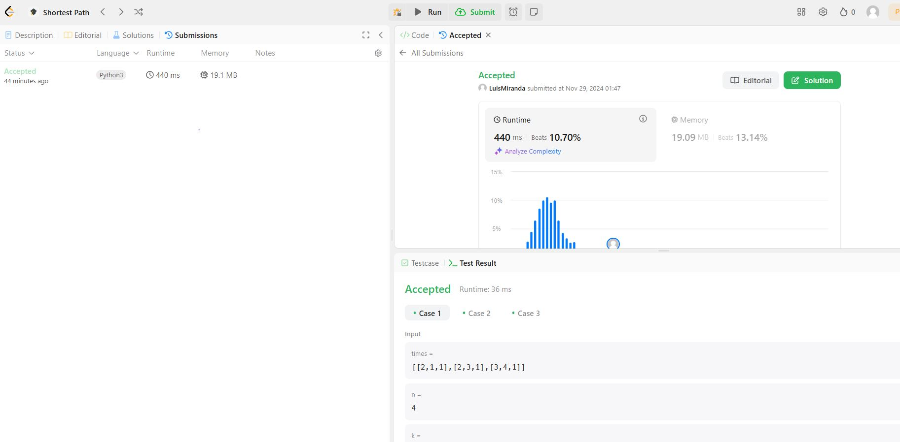

# Problemas do LeetCode envolvendo Grafos

Questões de Grafos 2 resolvidas no LeetCode pelos alunos Luis Miranda e Vinicius Mendes

**Número da Lista**: 2
**Conteúdo da Disciplina**: Grafos 2

## Alunos
|Matrícula | Aluno |
| -- | -- |
| 21/1063200  |  LUIS EDUARDO CARNEIRO MIRANDA |
| 21/1063265 |  VINICIUS MENDES MARTINS |

## Sobre 
Resolução de questões da plataforma LeetCode que contemplam os níveis médio e difícil de dificuldade.
O objetivo é abordar o conteúdo lecionado em sala de aula de forma simples e intuitiva, com códigos facilmente legíveis.

Os exercícios abordados são os seguintes
| Código do Problema | Nome do Problema | Dificuldade |
| ------------------ | ---------------- | ----------- |
| [743](https://leetcode.com/problems/network-delay-time/description/?envType=problem-list-v2&envId=shortest-path) | Network Delay Time| Médio |
| [2642](https://leetcode.com/problems/design-graph-with-shortest-path-calculator/description/) | Design Graph With Shortest Path Calculator | Difícil |
| . | | Difícil |

## Screenshots
 
### Network Delay Time

### Design Graph With Shortest Path Calculator 

### 

## Vídeo explicando cada questão

| Problema |
| ------------------ |
| [743. Network Delay Time](https://youtu.be/6By4HyWQnpM)| 
| [2642. Design Graph With Shortest Path Calculator](https://www.youtube.com/watch?v=Z0KzZCsAfP0)| 
|  | 

## Instalação 
**Linguagem**: C++ e Python

## Uso 
Para testar os códigos, basta entrar na plataforma [LeetCode](https://leetcode.com/), procurar pelos exercícios e colar na aba Code.
